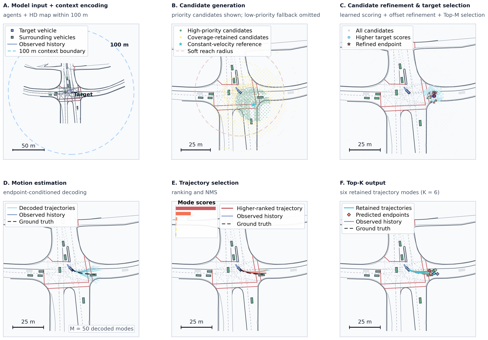
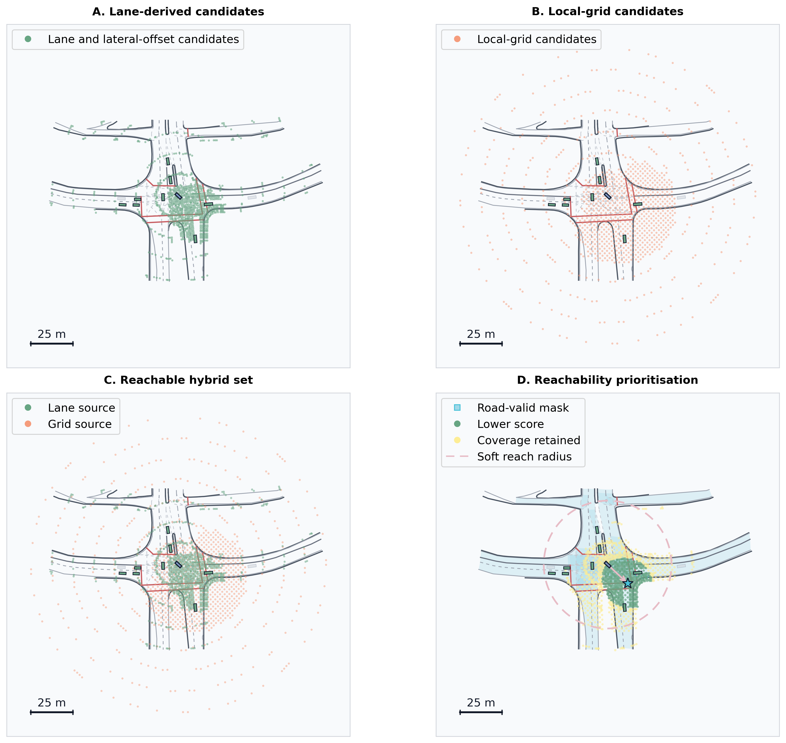
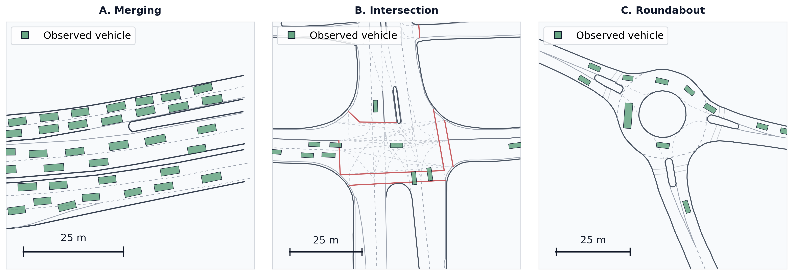

# Improved TNT for Trajectory Prediction on the INTERACTION Dataset

This repository contains the TNT/VectorNet trajectory-prediction pipeline developed for a scenario-based automated-driving research project. The implementation predicts multiple plausible vehicle trajectories from target history, neighbouring agents, and high-definition map polylines in the INTERACTION dataset.

The main adaptation is not a replacement backbone. It improves the endpoint-candidate stage that drives TNT, then adds endpoint-consistent motion decoding and a guarded deterministic refinement path.

## Results

Results below use 38,401 precomputed INTERACTION validation cases and the official longitudinal/lateral miss definition.

| Output | minADE (m) | minFDE (m) | MR |
|---|---:|---:|---:|
| Final TNT, deterministic T3+T6 output | 0.2875 | 0.8962 | 0.2063 |
| Final TNT, six trajectories | **0.1928** | **0.4978** | **0.0330** |

The deterministic and six-mode results are not directly interchangeable: the first tests the single selected future, while the second measures whether any of six plausible futures matches the observed outcome.

## Model Pipeline

The model retains the staged structure of TNT: scene encoding, target prediction, endpoint-conditioned motion estimation, trajectory scoring, and Top-K selection.



1. **Model input and context encoding:** vehicle histories and HD-map elements inside a 100 m local range are represented as polylines and encoded with VectorNet.
2. **Candidate generation:** lane-derived candidates, a local grid, and lateral offsets provide broad endpoint coverage.
3. **Target prediction:** candidates are scored and refined with learned offsets.
4. **Motion estimation:** a trajectory is decoded for each selected endpoint.
5. **Trajectory selection:** candidate trajectories are ranked and filtered with trajectory NMS.
6. **Top-K output:** the highest-ranked distinct trajectories are returned.

## Main Adaptations

### Reachability-informed hybrid endpoint candidates

The candidate pool combines:

- lane-derived samples from the INTERACTION map;
- local-grid samples for off-centre and weakly mapped regions;
- lateral offsets around lane-derived candidates;
- source quotas to preserve both map guidance and spatial coverage;
- speed- and horizon-dependent reachability prioritisation.

The reachability term is a soft prioritisation mechanism, not a formally computed vehicle-dynamics reachable set. It discourages implausibly distant candidates without removing all alternatives required for complex intersections and roundabouts.



### Target supervision and endpoint refinement

The target head uses soft spatial labels around the observed endpoint rather than treating only one discretised candidate as correct. It also predicts a continuous offset for each candidate. Together, these terms reduce sensitivity to candidate spacing and preserve nearby plausible targets.

### Endpoint-exact motion decoding

The motion decoder predicts future displacements conditioned on a refined endpoint. An endpoint residual is distributed across the decoded sequence so that the final trajectory position is consistent with the endpoint supplied to the decoder.

### Metric-aligned scoring

The trajectory-scoring objective can use an official-metric-aligned cost that combines ADE, FDE, and the INTERACTION miss condition. This makes the ranking objective more consistent with the evaluation used by the challenge.

### Guarded deterministic refinement

The final deterministic path computes a score-weighted trajectory and passes it through a lightweight T6 residual refiner conditioned on the shared scene context. A guarded joint fine-tuning stage updates the global context graph and target predictor only when the six-mode MR remains within a configured tolerance. This improves the single-output result without discarding TNT's multimodal capability.

## INTERACTION Scenarios

The project evaluates merging, intersection, and roundabout environments across the eleven vehicle-prediction scenarios used by the INTERACTION challenge.



## Repository Structure

```text
.
|-- improved_tnt/
|   |-- data/              # INTERACTION loading, polyline construction, candidates
|   |-- engine/            # training, validation, and official metrics
|   |-- losses/            # TNT target, motion, scoring, and consistency losses
|   |-- models/            # TNT, VectorNet, and deterministic T6 refiner
|   |-- utils/             # configuration, geometry, I/O, and seeding
|   `-- visualization/     # map and prediction plotting
|-- configs/
|   `-- experiments/       # train and validation YAML files
|-- scripts/
|   |-- diagnose_target_candidate_oracle.py
|   |-- train_tnt_weighted_refiner.py
|   |-- joint_finetune_tnt_k1_guarded.py
|   `-- evaluate_tnt_final_results.py
|-- tests/
|-- docs/images/
|-- precompute_cache.py
|-- train.py
`-- val.py
```

Generated datasets, caches, runs, and checkpoints are excluded from Git.

## Setup

Python 3.10 or later is recommended.

```bash
python -m venv .venv
```

Activate the environment and install the dependencies:

```bash
pip install -r requirements.txt
```

For GPU training, install the PyTorch build appropriate for the local CUDA version.

## Dataset

Download the INTERACTION dataset separately. The expected challenge layout is:

```text
recorded_trackfiles/
|-- DR_CHN_Merging_ZS/
|   |-- train/
|   `-- val/
`-- ...

maps/
|-- DR_CHN_Merging_ZS.osm
`-- ...
```

Update the portable paths in the YAML files:

```yaml
data_root: path/to/recorded_trackfiles
map_root: path/to/maps
```

The INTERACTION data and trained model weights are not distributed in this repository.

## Quick Start

### 1. Precompute train and validation caches

```bash
python precompute_cache.py --config configs/experiments/train/polyline/tnt_vectornet.yaml
```

### 2. Train the TNT/VectorNet model

```bash
python train.py --config configs/experiments/train/polyline/tnt_vectornet.yaml
```

The default configuration uses:

- 1 s observation history and 3 s future horizon at 10 Hz;
- 100 m agent and map context;
- 2,048 reachability-informed hybrid endpoint candidates;
- 50 decoded candidate modes and six retained trajectories;
- soft target labels, endpoint offsets, and endpoint-exact decoding.

### 3. Validate a checkpoint

Set `checkpoint` and cache paths in `configs/experiments/val/tnt_vectornet.yaml`, then run:

```bash
python val.py --config configs/experiments/val/tnt_vectornet.yaml
```

### 4. Train and evaluate the optional deterministic refinement

The staged refinement scripts require a trained TNT checkpoint and the same precomputed train/validation caches:

```bash
python scripts/train_tnt_weighted_refiner.py \
  --checkpoint path/to/tnt_checkpoint.pt \
  --train-cache path/to/train_cache.pt \
  --val-cache path/to/val_cache.pt \
  --output-dir runs/t6_refiner
```

```bash
python scripts/joint_finetune_tnt_k1_guarded.py \
  --t3-checkpoint path/to/tnt_checkpoint.pt \
  --t6-checkpoint runs/t6_refiner/best_t6_refiner.pt \
  --train-cache path/to/train_cache.pt \
  --val-cache path/to/val_cache.pt \
  --output-dir runs/guarded_joint
```

Use `--help` on either script for the complete optimisation and guardrail options.

## Evaluation Metrics

Validation reports the INTERACTION single-agent metrics:

- **minADE:** minimum mean Euclidean displacement error over the predicted modes;
- **minFDE:** minimum final Euclidean displacement error over the predicted modes;
- **MR:** a case is missed only when every mode exceeds the official final longitudinal or lateral threshold.

The lateral threshold is 1 m. The longitudinal threshold increases from 1 m to 2 m as final ground-truth speed increases from 1.4 m/s to 11 m/s. Implementations are provided in `improved_tnt/engine/official_metrics.py`.

## Tests

```bash
python -m pytest -q
```

The included tests cover the official metrics, endpoint-exact decoder, weighted T6 refiner, and guarded fine-tuning condition.

## References

- H. Zhao et al., [TNT: Target-driveN Trajectory Prediction](https://arxiv.org/abs/2008.08294), CoRL 2020.
- W. Zhan et al., [INTERACTION Dataset: An INTERnational, Adversarial and Cooperative moTION Dataset in Interactive Driving Scenarios with Semantic Maps](https://arxiv.org/abs/1910.03088), 2019.

## License

This repository is released under the Apache License 2.0. The INTERACTION dataset and any third-party assets remain subject to their respective licences.
