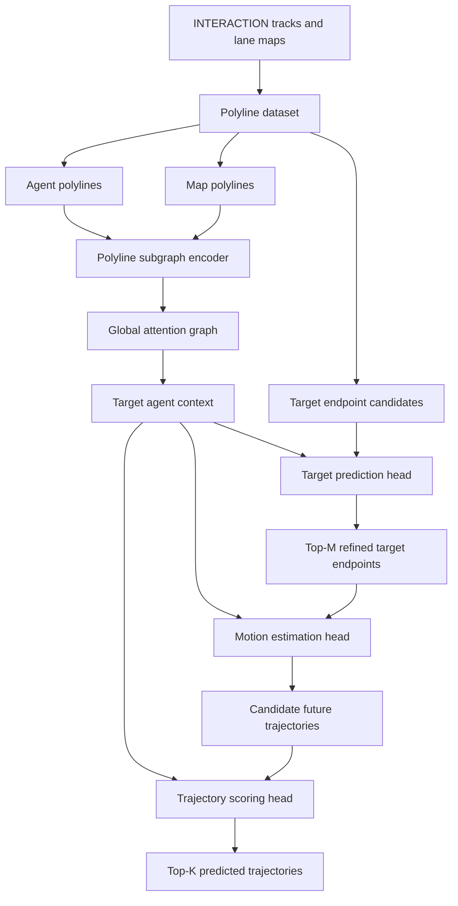

# Improved TNT for Trajectory Prediction on the INTERACTION Dataset

This repository contains a focused TNT/VectorNet trajectory prediction pipeline for the INTERACTION dataset. It keeps only the TNT-related model, loss, polyline data processing, training, validation, cache generation, and visualization code.

## Repository Name

Recommended GitHub repository name: `improved-tnt-interaction`.

Recommended display title: `Improved TNT for Trajectory Prediction on the INTERACTION Dataset`.

## Project Structure

The original research workspace used `src/trajectory_prediction/...` because it contained several trajectory prediction families. This split repository is TNT-only, so the package has been simplified to `improved_tnt/...`.

```text
Improved TNT/
|-- improved_tnt/
|   |-- data/              # INTERACTION polyline dataset and target candidates
|   |-- engine/            # train/evaluate/checkpoint utilities
|   |-- losses/            # TNT training loss
|   |-- models/            # TNT and VectorNet encoder modules
|   |-- utils/             # config, geometry, I/O, seeding helpers
|   `-- visualization/     # prediction and map plotting
|-- configs/
|   `-- experiments/
|       |-- train/polyline/tnt_vectornet.yaml
|       `-- val/tnt_vectornet.yaml
|-- scripts/
|   `-- diagnose_target_candidate_oracle.py
|-- precompute_cache.py
|-- train.py
`-- val.py
```

Large generated artifacts are intentionally excluded from Git:

- `cache/`
- `runs/`
- model checkpoints such as `*.pt`
- local dataset folders

## Model Overview

The model follows the TNT idea: encode the scene as polylines, score endpoint candidates, generate a trajectory for selected endpoints, and rank the generated trajectories.



Main implementation files:

- `improved_tnt/models/tnt.py`: TNT target prediction, motion estimation, and trajectory scoring.
- `improved_tnt/models/vectornet.py`: VectorNet polyline encoders used by TNT.
- `improved_tnt/data/polyline.py`: INTERACTION polyline features and target-candidate generation.
- `improved_tnt/losses/tnt_loss.py`: TNT multi-part training loss.

## Metrics

Let the ground-truth future trajectory be:

$$
Y = \{y_1, y_2, \ldots, y_T\}, \qquad y_t \in \mathbb{R}^2
$$

For one predicted trajectory:

$$
\hat{Y} = \{\hat{y}_1, \hat{y}_2, \ldots, \hat{y}_T\}, \qquad \hat{y}_t \in \mathbb{R}^2
$$

For a multimodal prediction with $K$ modes:

$$
\hat{Y}^{(k)} = \{\hat{y}^{(k)}_1, \hat{y}^{(k)}_2, \ldots, \hat{y}^{(k)}_T\}, \qquad k \in \{1,\ldots,K\}
$$

### Average Displacement Error

Single-mode ADE:

$$
\operatorname{ADE}
= \frac{1}{T}\sum_{t=1}^{T}
\left\lVert \hat{y}_t - y_t \right\rVert_2
$$

Multimodal minimum ADE:

$$
\operatorname{minADE}_K
= \min_{k \in \{1,\ldots,K\}}
\frac{1}{T}\sum_{t=1}^{T}
\left\lVert \hat{y}^{(k)}_t - y_t \right\rVert_2
$$

### Final Displacement Error

Single-mode FDE:

$$
\operatorname{FDE}
= \left\lVert \hat{y}_T - y_T \right\rVert_2
$$

Multimodal minimum FDE:

$$
\operatorname{minFDE}_K
= \min_{k \in \{1,\ldots,K\}}
\left\lVert \hat{y}^{(k)}_T - y_T \right\rVert_2
$$

### Miss Rate

For samples that include final heading and speed, validation uses the INTERACTION-style longitudinal/lateral miss rule. Define the final displacement error vector:

$$
d = \hat{y}_T - y_T = (d_x, d_y)
$$

Given the ground-truth final yaw $\theta$, the error is projected into the target heading frame:

$$
e_{\mathrm{long}}
= d_x \cos\theta + d_y \sin\theta
$$

$$
e_{\mathrm{lat}}
= -d_x \sin\theta + d_y \cos\theta
$$

The lateral threshold is fixed:

$$
\tau_{\mathrm{lat}} = 1.0\ \mathrm{m}
$$

The longitudinal threshold depends on the ground-truth final speed $v$:

$$
\tau_{\mathrm{long}}(v)=
\begin{cases}
1.0, & v < 1.4\ \mathrm{m/s} \\
2.0, & v > 11.0\ \mathrm{m/s} \\
1.0 + \dfrac{v - 1.4}{11.0 - 1.4}, & \text{otherwise}
\end{cases}
$$

A predicted mode is counted as a miss when:

$$
\left|e_{\mathrm{lat}}\right| > \tau_{\mathrm{lat}}
\quad \mathrm{or} \quad
\left|e_{\mathrm{long}}\right| > \tau_{\mathrm{long}}(v)
$$

For $K$ predicted modes, a sample is counted as a miss only if all modes miss:

$$
m_i =
\begin{cases}
1, & \text{all } K \text{ modes miss} \\
0, & \text{otherwise}
\end{cases}
$$

The miss rate over $N$ validation samples is:

$$
\operatorname{MR}
= \frac{1}{N}\sum_{i=1}^{N} m_i
$$

If final yaw/speed are not available in an older cache, the code falls back to a fixed FDE threshold:

$$
m_i =
\begin{cases}
1, & \operatorname{minFDE}_K > \tau_{\mathrm{FDE}} \\
0, & \operatorname{minFDE}_K \le \tau_{\mathrm{FDE}}
\end{cases}
$$

The default fallback threshold is:

$$
\tau_{\mathrm{FDE}} = 2.0\ \mathrm{m}
$$

## TNT Training Loss

The training objective combines target candidate classification, endpoint offset regression, trajectory regression, trajectory scoring, and endpoint consistency:

$$
\mathcal{L}
= \lambda_{\mathrm{target}}\mathcal{L}_{\mathrm{target}}
+ \lambda_{\mathrm{motion}}\mathcal{L}_{\mathrm{motion}}
+ \lambda_{\mathrm{score}}\mathcal{L}_{\mathrm{score}}
+ \lambda_{\mathrm{pred}}\mathcal{L}_{\mathrm{pred}}
+ \lambda_{\mathrm{endpoint}}\mathcal{L}_{\mathrm{endpoint}}
$$

Target classification selects the candidate endpoint closest to the ground-truth final point:

$$
c^\ast
= \arg\min_{j}
\left\lVert c_j - y_T \right\rVert_2
$$

The target offset regression term predicts the residual from the selected candidate to the true endpoint:

$$
\Delta^\ast = y_T - c^\ast
$$

$$
\mathcal{L}_{\mathrm{offset}}
= \operatorname{SmoothL1}
\left(
\widehat{\Delta}_{c^\ast},
\Delta^\ast
\right)
$$

Trajectory regression trains the trajectory generated from the ground-truth endpoint:

$$
\mathcal{L}_{\mathrm{motion}}
= \operatorname{SmoothL1}
\left(
\hat{Y}_{\mathrm{gt}},
Y
\right)
$$

Trajectory scoring supervises the generated candidate trajectories using the best-matching trajectory mode:

$$
k^\ast
= \arg\min_k
\max_{t \in \{1,\ldots,T\}}
\left\lVert \hat{y}^{(k)}_t - y_t \right\rVert_2^2
$$

$$
\mathcal{L}_{\mathrm{score}}
= \operatorname{CrossEntropy}
\left(
s,
k^\ast
\right)
$$

Endpoint consistency encourages each generated trajectory endpoint to remain close to its selected endpoint candidate:

$$
\mathcal{L}_{\mathrm{endpoint}}
= \operatorname{SmoothL1}
\left(
\hat{y}^{(k)}_T,
\hat{c}^{(k)}
\right)
$$

## Setup

Install Python dependencies:

```bash
pip install -r requirements.txt
```

Install a PyTorch build that matches your CUDA version if GPU training is needed.

## Dataset

Download the INTERACTION dataset separately and update these paths in the YAML configs:

```yaml
data_root: F:/IRP/dataset/INTERACTION-Dataset-For-Challenge/recorded_trackfiles
map_root: F:/IRP/dataset/INTERACTION-Dataset-For-Challenge/maps
```

The dataset is not included in this repository.

## Precompute Caches

The default training config uses tensor caches. Build train and validation caches with:

```bash
python precompute_cache.py --config configs/experiments/train/polyline/tnt_vectornet.yaml
```

The cache paths are configured as:

```yaml
cache_path: cache/VectorNet/tnt_vectornet_train_11scenes_100m_5k_p96_s30_c2048_reachable_quota_hybrid.pt
val_cache_path: cache/VectorNet/tnt_vectornet_val_11scenes_100m_5k_p96_s30_c2048_reachable_quota_hybrid.pt
```

## Train

```bash
python train.py --config configs/experiments/train/polyline/tnt_vectornet.yaml
```

Training outputs are written under `runs/tnt_vectornet/train/`.

## Validate

Update `checkpoint` in `configs/experiments/val/tnt_vectornet.yaml`, then run:

```bash
python val.py --config configs/experiments/val/tnt_vectornet.yaml
```

Validation outputs are written under `runs/tnt_vectornet/val/`.
