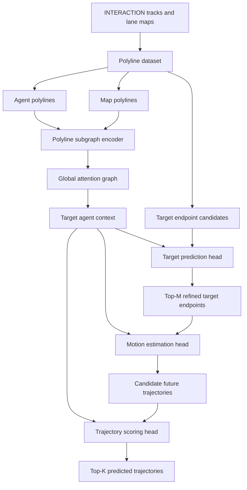

# Improved TNT for Trajectory Prediction on the INTERACTION Dataset

This repository contains a focused TNT/VectorNet trajectory prediction pipeline for the INTERACTION dataset. It keeps only the TNT-related model, loss, polyline data processing, training, validation, cache generation, and visualization code.

## Repository Name

Recommended GitHub repository name: `improved-tnt-interaction`.

Recommended display title: `Improved TNT for Trajectory Prediction on the INTERACTION Dataset`.

## Project Structure

The original research workspace used `src/trajectory_prediction/...` because it contained several trajectory prediction families. This split repository is TNT-only, so the package has been simplified to `improved_tnt/...`.

```text
Improved TNT/
├── improved_tnt/
│   ├── data/              # INTERACTION polyline dataset and target candidates
│   ├── engine/            # train/evaluate/checkpoint utilities
│   ├── losses/            # TNT training loss
│   ├── models/            # TNT and VectorNet encoder modules
│   ├── utils/             # config, geometry, I/O, seeding helpers
│   └── visualization/     # prediction and map plotting
├── configs/
│   └── experiments/
│       ├── train/polyline/tnt_vectornet.yaml
│       └── val/tnt_vectornet.yaml
├── scripts/
│   └── diagnose_target_candidate_oracle.py
├── precompute_cache.py
├── train.py
└── val.py
```

Large generated artifacts are intentionally excluded from Git:

- `cache/`
- `runs/`
- model checkpoints such as `*.pt`
- local dataset folders

## Model Overview

The model follows the TNT idea: encode the scene as polylines, score endpoint candidates, generate a trajectory for selected endpoints, and rank the generated trajectories.



Main implementation files:

- `improved_tnt/models/tnt.py`: TNT target prediction, motion estimation, and trajectory scoring.
- `improved_tnt/models/vectornet.py`: VectorNet polyline encoders used by TNT.
- `improved_tnt/data/polyline.py`: INTERACTION polyline features and target-candidate generation.
- `improved_tnt/losses/tnt_loss.py`: TNT multi-part training loss.

## Metrics

Let a ground-truth future trajectory be:

```text
Y = {y_1, y_2, ..., y_T}, y_t in R^2
```

For a single predicted trajectory:

```text
Y_hat = {y_hat_1, y_hat_2, ..., y_hat_T}, y_hat_t in R^2
```

For a multimodal prediction with `K` modes:

```text
Y_hat_k = {y_hat_{k,1}, y_hat_{k,2}, ..., y_hat_{k,T}}, k = 1..K
```

### Average Displacement Error

Single-mode ADE:

```text
ADE = (1 / T) * sum_{t=1}^{T} || y_hat_t - y_t ||_2
```

Multimodal minimum ADE:

```text
minADE_K = min_{k in {1..K}} (1 / T) * sum_{t=1}^{T} || y_hat_{k,t} - y_t ||_2
```

### Final Displacement Error

Single-mode FDE:

```text
FDE = || y_hat_T - y_T ||_2
```

Multimodal minimum FDE:

```text
minFDE_K = min_{k in {1..K}} || y_hat_{k,T} - y_T ||_2
```

### Miss Rate

For cached samples that include final heading and speed, validation uses the INTERACTION-style longitudinal/lateral miss rule. Let the final displacement error vector be:

```text
d = y_hat_T - y_T
```

With ground-truth final yaw `theta`, project the final error into the target heading frame:

```text
e_long = d_x * cos(theta) + d_y * sin(theta)
e_lat  = -d_x * sin(theta) + d_y * cos(theta)
```

The lateral threshold is fixed:

```text
tau_lat = 1.0 m
```

The longitudinal threshold depends on final speed `v`:

```text
tau_long(v) =
  1.0,                         if v < 1.4 m/s
  2.0,                         if v > 11.0 m/s
  1.0 + (v - 1.4) / (11 - 1.4), otherwise
```

A mode is a miss if:

```text
|e_lat| > tau_lat or |e_long| > tau_long(v)
```

For `K` predicted modes, a sample is counted as a miss only if all modes miss:

```text
miss = 1 if every mode misses, otherwise 0
MR = (1 / N) * sum_{i=1}^{N} miss_i
```

If final yaw/speed are not available in an older cache, the code falls back to a fixed FDE threshold:

```text
miss = 1 if minFDE_K > tau_fde
```

The default fallback threshold is `tau_fde = 2.0 m`.

## TNT Training Loss

The training objective combines endpoint candidate classification, endpoint offset regression, trajectory regression, trajectory scoring, and endpoint consistency.

```text
L = w_target * L_target
  + w_motion * L_motion
  + w_score * L_score
  + w_pred_motion * L_pred_motion
  + w_endpoint * L_endpoint
```

Target classification selects the candidate closest to the ground-truth final point:

```text
c* = argmin_j || c_j - y_T ||_2
```

The target offset regression term predicts the residual from the selected candidate to the true endpoint:

```text
Delta* = y_T - c*
L_offset = SmoothL1(Delta_hat_{c*}, Delta*)
```

Trajectory regression trains the trajectory generated from the ground-truth endpoint:

```text
L_motion = SmoothL1(Y_hat_gt, Y)
```

Trajectory scoring supervises the generated candidate trajectories using the best-matching trajectory mode:

```text
k* = argmin_k max_t || y_hat_{k,t} - y_t ||_2^2
L_score = CrossEntropy(score_logits, k*)
```

Endpoint consistency encourages generated trajectory endpoints to agree with their selected endpoint candidates and with the ground-truth endpoint when teacher forcing is used.

## Setup

Install Python dependencies:

```bash
pip install -r requirements.txt
```

Install a PyTorch build that matches your CUDA version if GPU training is needed.

## Dataset

Download the INTERACTION dataset separately and update these paths in the YAML configs:

```yaml
data_root: F:/IRP/dataset/INTERACTION-Dataset-For-Challenge/recorded_trackfiles
map_root: F:/IRP/dataset/INTERACTION-Dataset-For-Challenge/maps
```

The dataset is not included in this repository.

## Precompute Caches

The default training config uses tensor caches. Build train and validation caches with:

```bash
python precompute_cache.py --config configs/experiments/train/polyline/tnt_vectornet.yaml
```

The cache paths are configured as:

```yaml
cache_path: cache/VectorNet/tnt_vectornet_train_11scenes_100m_5k_p96_s30_c2048_reachable_quota_hybrid.pt
val_cache_path: cache/VectorNet/tnt_vectornet_val_11scenes_100m_5k_p96_s30_c2048_reachable_quota_hybrid.pt
```

## Train

```bash
python train.py --config configs/experiments/train/polyline/tnt_vectornet.yaml
```

Training outputs are written under `runs/tnt_vectornet/train/`.

## Validate

Update `checkpoint` in `configs/experiments/val/tnt_vectornet.yaml`, then run:

```bash
python val.py --config configs/experiments/val/tnt_vectornet.yaml
```

Validation outputs are written under `runs/tnt_vectornet/val/`.
