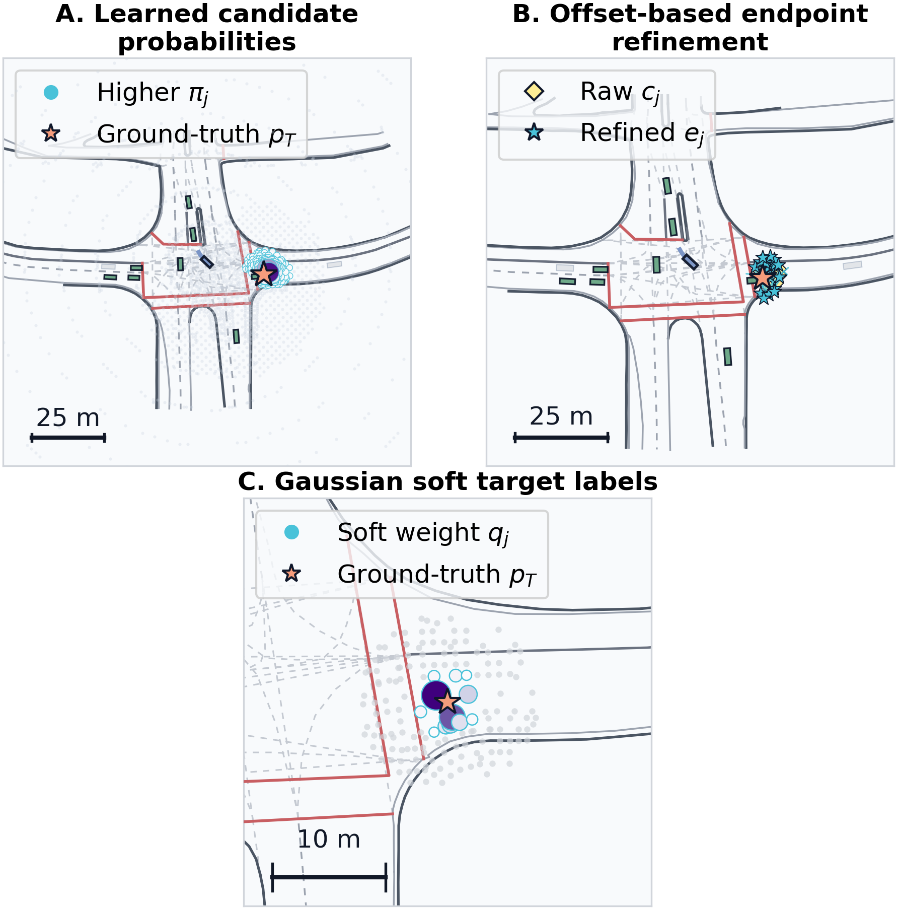
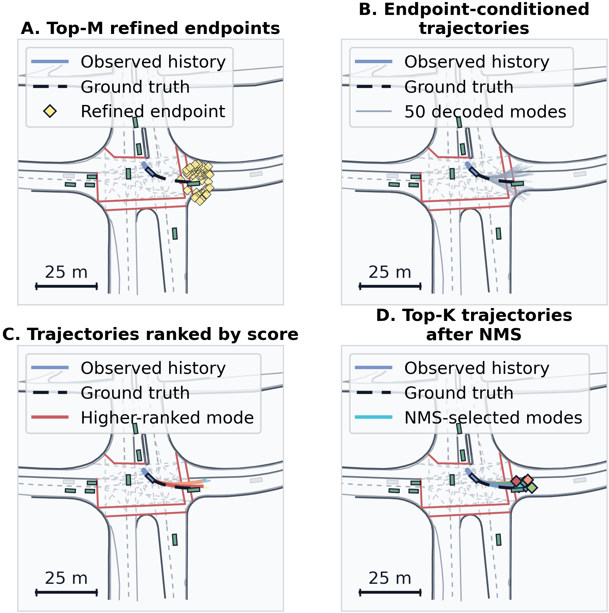
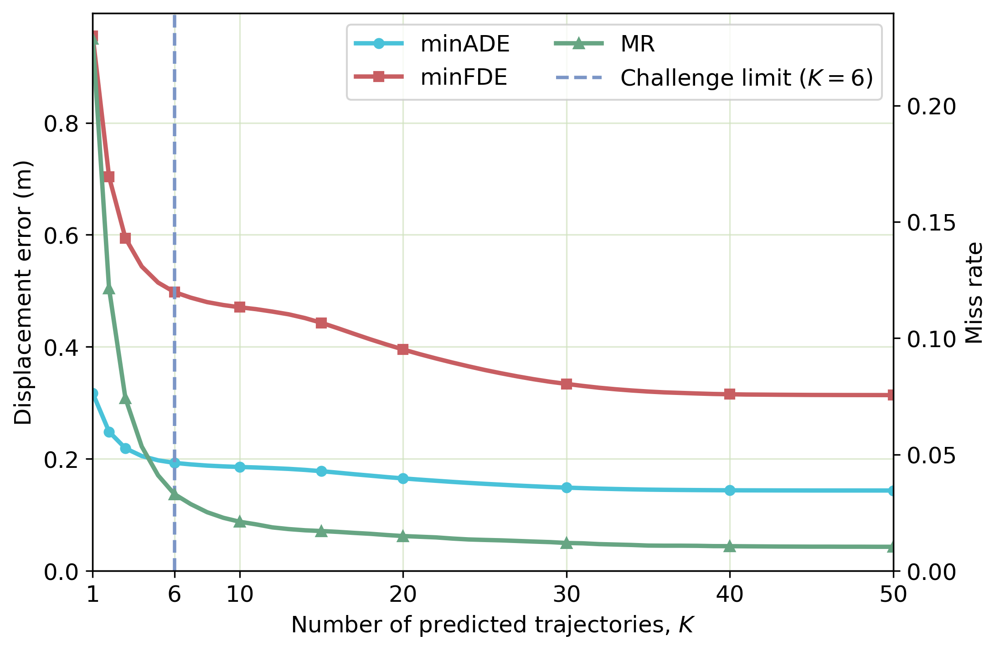

# Improved TNT for Multi-Modal Vehicle Trajectory Prediction

[](https://www.python.org/)
[](https://pytorch.org/)
[](https://interaction-dataset.com/)
[](LICENSE)

An improved [TNT](https://arxiv.org/abs/2008.08294)/[VectorNet](https://arxiv.org/abs/2005.04259) pipeline for scenario-based vehicle trajectory prediction on the [INTERACTION dataset](https://interaction-dataset.com/). The model predicts six spatially distinct future trajectories from target history, neighbouring vehicles, and high-definition map polylines.

The main change is not a replacement backbone. This project improves the endpoint-candidate stage that drives TNT, introduces endpoint-consistent decoding and metric-aligned ranking, and retains a guarded refinement path for deterministic prediction.

> **Scope.** The reported values are obtained on a fixed 38,401-case INTERACTION validation set. They are research results, not an official test-server submission. Dataset files, tensor caches, and trained weights are intentionally excluded from this repository.

## Model Overview


The end-to-end pipeline contains six stages:

1. **Context encoding:** target and neighbouring-agent histories, together with HD-map elements inside a 100 m context range, are converted to polylines and encoded by VectorNet.
2. **Candidate generation:** lane-derived samples, lateral offsets, and a local grid form a broad endpoint pool; speed- and horizon-dependent reachability provides soft prioritisation.
3. **Candidate refinement and target selection:** the target head assigns candidate probabilities, predicts continuous offsets, and retains the Top-M refined endpoints.
4. **Motion estimation:** complete future trajectories are decoded conditional on each selected endpoint.
5. **Trajectory scoring:** candidate trajectories are ranked and near-duplicate modes are removed by trajectory non-maximum suppression (NMS).
6. **Top-K output:** the six highest-ranked, spatially distinct trajectories are returned.

## What Is Improved

### 1. Reachability-informed hybrid candidates

Standard endpoint sampling can under-represent turns, lane changes, and weakly mapped regions. The implemented `reachable_quota_hybrid` strategy combines:

- lane-derived candidates following mapped road structure;
- lateral offsets of `[-2, -1, 0, 1, 2]` m around lane-derived samples;
- a local 2 m grid that supplies complementary spatial coverage;
- separate lane and grid quotas within the 2,048-candidate budget;
- a constant-velocity reference and speed/horizon-dependent soft reach radius.


Reachability is used as a **soft prioritisation mechanism**, not as a formally computed dynamics reachable set. The road-valid region shown in panel D is a diagnostic visual overlay and is not applied as a hard mask in the reported model.

### 2. Soft target labels and continuous endpoint refinement

The target head uses Gaussian soft labels around the observed endpoint instead of treating only one discretised candidate as correct. It also predicts a two-dimensional offset for every candidate, reducing sensitivity to sample spacing and moving selected endpoints from discrete map samples towards continuous target locations.



### 3. Endpoint-consistent motion estimation

For each refined endpoint, the motion head decodes a complete future trajectory. An endpoint residual is distributed through the decoded sequence so that the final predicted position is exactly consistent with the endpoint supplied to the decoder.

### 4. Metric-aligned scoring and diverse selection

Trajectory-scoring supervision can combine ADE, FDE, and the official INTERACTION miss condition. At inference, trajectory NMS removes near-duplicate modes before the final Top-K trajectories are returned.



### 5. Guarded deterministic refinement

The optional single-output path forms a score-weighted trajectory and applies a lightweight T6 residual refiner conditioned on the shared scene representation. Guarded joint fine-tuning updates only the global context graph and target-prediction module, while preserving the six-mode MR within a configured tolerance. This path improves deterministic output without replacing TNT's multimodal prediction mechanism.

## Validation Results

All results below use the same 38,401 validation cases and the official INTERACTION single-agent metric implementation.

| Output configuration | ADE/minADE (m) | FDE/minFDE (m) | MR |
|---|---:|---:|---:|
| Guarded T3 + T6 deterministic output | 0.2875 | 0.8962 | 0.2063 |
| Final TNT, six trajectories | **0.1928** | **0.4978** | **0.0330** |

The two rows answer different questions. The deterministic result evaluates one selected future, whereas the six-mode result succeeds when any retained trajectory matches the observed future.

### Effect of the output budget



The largest gain occurs between one and six predicted trajectories. At the challenge-compatible setting of `K=6`, minADE, minFDE, and MR are 0.1928 m, 0.4978 m, and 0.0330. Values above six are included only to diagnose convergence; they exceed the challenge output allowance and are not leaderboard-comparable. The underlying values are available in [`docs/results/final_ranked_k_sweep.csv`](docs/results/final_ranked_k_sweep.csv).

## Dataset and Experimental Scope

The project uses all eleven vehicle-prediction scenarios from the INTERACTION challenge, covering merging, intersection, and roundabout environments.


The main configuration uses:

| Setting | Value |
|---|---:|
| Sampling rate | 10 Hz |
| Observation history | 1 s / 10 steps |
| Prediction horizon | 3 s / 30 steps |
| Agent and map context | 100 m |
| Neighbour budget | 8 vehicles |
| Map-polyline budget | 96 |
| Endpoint-candidate budget | 2,048 |
| Decoded candidate modes | 50 |
| Retained output modes | 6 |
| Random seed | 7 |

## Repository Structure

```text
.
|-- improved_tnt/
|   |-- data/              # INTERACTION loading, polylines, and candidates
|   |-- engine/            # training, validation, checkpoints, and metrics
|   |-- losses/            # target, motion, scoring, and consistency losses
|   |-- models/            # VectorNet, TNT, and optional T6 refinement
|   |-- utils/             # configuration, geometry, I/O, and reproducibility
|   `-- visualization/     # map and trajectory visualisation
|-- configs/
|   `-- experiments/       # portable train and validation configurations
|-- scripts/               # final refinement, diagnostics, and evaluation
|-- tests/                 # focused regression and metric tests
|-- docs/
|   |-- images/            # figures used by this README
|   `-- results/           # compact numerical result files
|-- precompute_cache.py
|-- train.py
`-- val.py
```

Generated datasets, tensor caches, checkpoints, and run directories are ignored by Git.

## Installation

Python 3.10 or later is recommended. Install a PyTorch build compatible with the local CUDA toolkit, then install the remaining dependencies:

```bash
python -m venv .venv
pip install -r requirements.txt
```

The repository has no dependency on the original Argoverse API.

## Data Preparation

Download the INTERACTION dataset separately and arrange the challenge data as follows:

```text
data/INTERACTION/
|-- recorded_trackfiles/
|   |-- DR_CHN_Merging_ZS/
|   |   |-- train/
|   |   `-- val/
|   `-- ...
`-- maps/
    |-- DR_CHN_Merging_ZS.osm
    `-- ...
```

If the dataset is stored elsewhere, update `data_root`, `map_root`, and cache paths in the YAML configurations. Do not commit local absolute paths.

## Quick Start

### 1. Precompute tensor caches

Polyline construction and candidate generation are CPU-intensive. Build the train and validation tensors once:

```bash
python precompute_cache.py --config configs/experiments/train/polyline/tnt_vectornet.yaml
```

The cache metadata records the temporal horizons, coordinate scale, map settings, and candidate-generation parameters. Training and validation check compatibility before reusing a cache.

### 2. Train TNT/VectorNet

```bash
python train.py --config configs/experiments/train/polyline/tnt_vectornet.yaml
```

The default experiment uses soft target labels, endpoint offsets, endpoint-exact decoding, official-metric-aligned scoring, EMA validation, and six-mode NMS output.

### 3. Validate a checkpoint

Set `checkpoint` and `cache_path` in `configs/experiments/val/tnt_vectornet.yaml`, then run:

```bash
python val.py --config configs/experiments/val/tnt_vectornet.yaml
```

Validation reports overall and scenario-specific minADE, minFDE, and MR.

### 4. Optional deterministic refinement

Train the T6 residual refiner from a trained TNT checkpoint:

```bash
python scripts/train_tnt_weighted_refiner.py \
  --checkpoint path/to/tnt_checkpoint.pt \
  --train-cache path/to/train_cache.pt \
  --val-cache path/to/val_cache.pt \
  --output-dir runs/t6_refiner
```

Then jointly fine-tune the guarded context and target modules:

```bash
python scripts/joint_finetune_tnt_k1_guarded.py \
  --t3-checkpoint path/to/tnt_checkpoint.pt \
  --t6-checkpoint runs/t6_refiner/best_t6_refiner.pt \
  --train-cache path/to/train_cache.pt \
  --val-cache path/to/val_cache.pt \
  --output-dir runs/guarded_joint
```

Use `--help` to inspect all optimisation and guardrail options.

## Evaluation Metrics

- **minADE:** minimum, over all predicted modes, of the mean Euclidean displacement error across the prediction horizon.
- **minFDE:** minimum final-position displacement error across the predicted modes.
- **MR:** a case is missed only if every mode exceeds the official longitudinal or lateral final-position threshold.

The official lateral threshold is 1 m. The longitudinal threshold rises linearly from 1 m to 2 m as the target's final ground-truth speed increases from 1.4 m/s to 11 m/s. The implementation is in [`improved_tnt/engine/official_metrics.py`](improved_tnt/engine/official_metrics.py).

## Tests

Run the focused unit and regression tests before changing candidate generation, decoding, or metric code:

```bash
python -m pytest -q
```

The test suite covers official metrics, endpoint-exact decoding, weighted refinement, and the guarded fine-tuning condition.

## Reproducibility Notes

- Keep the same validation cache and anchor set when comparing variants.
- Report whether a result uses deterministic `K=1` output or multimodal `K=6` output.
- Treat results above `K=6` as diagnostic only.
- Keep the reachability mechanism described as soft prioritisation rather than a formal dynamics guarantee.
- The diagnostic road-validity overlay is not part of the reported inference pipeline.

## References and Attribution

- H. Zhao et al., [TNT: Target-driveN Trajectory Prediction](https://arxiv.org/abs/2008.08294), CoRL 2020.
- J. Gao et al., [VectorNet: Encoding HD Maps and Agent Dynamics from Vectorized Representation](https://arxiv.org/abs/2005.04259), CVPR 2020.
- W. Zhan et al., [INTERACTION Dataset: An INTERnational, Adversarial and Cooperative moTION Dataset in Interactive Driving Scenarios with Semantic Maps](https://arxiv.org/abs/1910.03088), 2019.
- The project was developed from concepts and code patterns in the original [`Henry1iu/TNT-Trajectory-Prediction`](https://github.com/Henry1iu/TNT-Trajectory-Prediction) implementation. Its authors and licence should be acknowledged when this derivative implementation is reused.

## License

This repository is distributed under the [Apache License 2.0](LICENSE). The INTERACTION dataset and all third-party materials remain subject to their respective licences.
